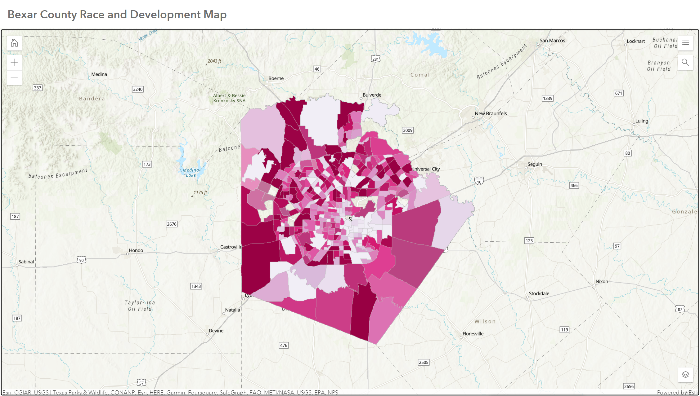
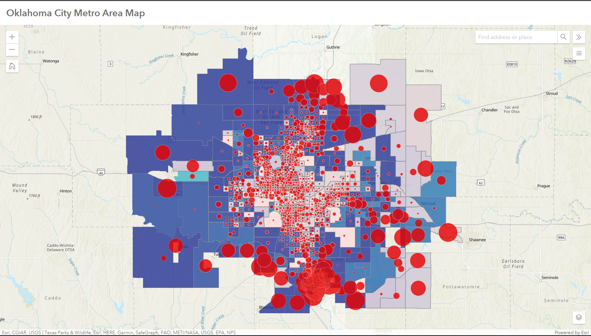

## Portfolio

---

### Current Projects

[Socioeconomic Influes of Health Care Coverage in the Rio Grande Valley](/sample_page)

---
[Residential Choices based on Proximity and Income Module](/pdf/regi0011_module.py)

---
[Residential Choices based on Proximity and Income Main File](/pdf/regi0011_main.py)

---
[Socioeconomic Influences of Health Care Discrepancy in the Rio Grande Valley](/pdf/sec_rgv_working_file.R)

---

---

---

### Other Projects

- [Google Earth Engine: Burned Area Investigation](https://jrregi05.users.earthengine.app/view/burned-area-investigation)
- [Project 2 Title](http://example.com/)
- [Project 3 Title](http://example.com/)
- [Project 4 Title](http://example.com/)
- [Project 5 Title](http://example.com/)

Page template forked from <a href="https://github.com/evanca/quick-portfolio">evanca</a>

<!-- Remove above link if you don't want to attibute -->
